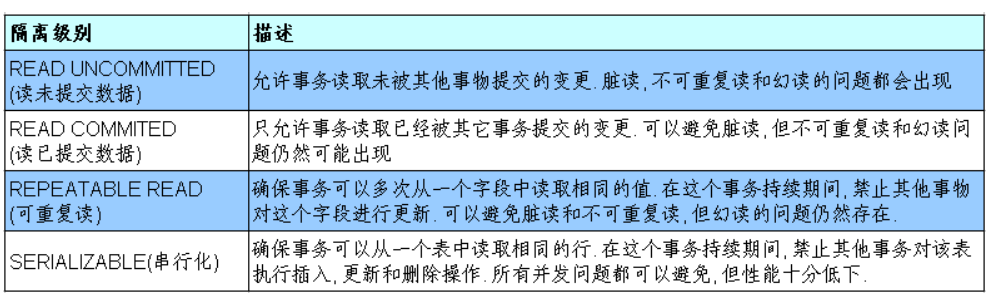

# 	0 前言 

## 视频顺序

1、李玉婷经典版MySQL基础：P001---P178
2、周阳Mysql高级：---------- P179---P242
3、李玉婷2019版MySQL基础：P243---P326
4、夏磊2019MySQL高级:---- P327---P350

注：MySQL高级建议先看夏磊:---- P327---P350, 再看周阳：---------- P179---P242; 因为夏磊老师讲的比较细, 对初学比较友好, 而阳哥讲的偏理论点和深入(内容也比较多), 适合用来复习和巩固


## MySQL配置

MySQL配置（my.ini配置文化，写字板打开）
服务名：MySQL0824
密码：982416
port(端口号)：3306


## MySQL服务的启动和停止

+  方式一：通过命令行
   + net start 服务名
   + net stop 服务名

+  方式二：计算机——右击——管理——服务


## MySQL服务的登录和退出

方式一：MySQL自带的软件（只适用于root用户）

方式二：

登录：mysql 【-h 主机名 -P 端口号】 -u 用户名 -p密码（-p和密码不能有空格，其余无所谓）

退出：exit（推荐）或ctrl+C（只适用于root用户）


## MySQL常见命令

1.查看当前所有的数据库	`show databases;`

2.打开指定的库	`use 库名`

3.查看当前库的所有表		`show tables;`

4.查看其它库的所有表	`show tables from 库名;`

5.创建表

```mysql
create table 表名(
	列名 列类型，
    列名 列类型，
    。。。
)
```

6.查看表结构	`desc 表名;`

7.查看服务器版本

+ 方式一：登录到mysql服务端	`select version();`
+ 方式二：没有登录到mysql服务端
  + `mysql --version`
  + `mysql --V`


## MySQL语法规范

1.不区分大小写，但建议：关键字大写，表名、列名小写

2.每条命令用分号结尾

3.每条命令根据需要，可以进行缩进 或 换行（一般关键字单独一行）

4.注释

+ 单行注释： `#注释文字` 或 `-- 注释文字`

+ 多行注释：`/*注释文字*/`


# 1 DQL语言

+ DQL —— `Data Query Language`数据库查询语言（查）

## 1.1 基础查询

语法：select 查询列表 from 表名;

特点：

+ 查询列表可以是：表中的字段、常量值、表达式、函数，也可以是多个
+ 查询结果是一个虚拟表

### 示例

1. 查询单个字段：select 字段名 from 表名;

2. 查询多个字段：select 字段名，字段名 from 表名;

3. 查询所有字段：select * from 表名

4. 查询常量值
   + SELECT 100;
   + SELECT 'john';
   + **注意：**字符型和日期型的常量值必须用单引号引起来，数值型不需要
   
5. 查询表达式：SELECT 100%99;

6. 查询函数：如 SELECT VERSION();

   + select 函数名(实参列表);
   + mysql的函数调用必须有`select`，且函数都有返回值

7. 起别名

   + 便于理解
   + 如果要查询的字段有重名的情况，使用别名可以区分开来

   ```mysql
   #方式一：使用 AS
   SELECT 100%98 AS 结果;
   SELECT last_name AS 姓,first_name AS 名 FROM employees;
   
   #方式二：使用空格
   SELECT last_name 姓, first_name 名 FROM employees;
   
   #练习：查询salary,显示结果为 out put
   SELECT salary "out put" FROM employees;
   #若别名有特殊符号，如：空格、#等，则用双引号括起来(单引号也行)
   ```

8. 去重：在查询字段前加关键字 `distinct`

   ```mysql
   #案例：查询员工表中涉及到的所有的部门编号
   SELECT DISTINCT department_id FROM employees;
   #不能用于两个字段，如:select distinct a, b from 表名;
   ```

9. +号的作用：运算符（仅有这一个功能）

   ```mysql
   /*
   select 100+90; 两个操作数都为数值型，则做加法运算
   select '123'+90; 其中一个为字符型，试图将字符型数值转换成数值型
   				 若转换成功，则继续做加法运算
   select 'john'+90; 如果转换失败，则将字符型数值转换为0
   select null+10; 只要其中一方为null，则结果肯定为null
   */
   
   #案例：查询员工名和姓连接成一个字段，并显示为 姓名
   #拼接不能用+，用函数：concat(str1,str2...)
   SELECT CONCAT('a','b','c') AS 结果;
   SELECT 
     CONCAT(last_name, ' ',first_name) AS 姓名 
   FROM
     employees ;
   ```

**补充：**

10. `concat`函数，功能：拼接字符
    + `select concat(字符1，字符2，字符3,...);`
    + 数值型也会自动转换字符型
11. `ifnull`函数，功能：判断某字段或表达式是否为null，如果为null 返回指定的值，否则返回原本的值
    `select ifnull(commission_pct,0) from employees;`
12. `isnull`函数
    功能：判断某字段或表达式是否为null，如果是，则返回1，否则返回0


## 1.2 条件查询

+ 语法：select 查询列表 from 表名 where 筛选条件；
+ 分类：

一、按条件表达式筛选

+ 条件运算符：> < =(判断等于)` != ` 或 `<>`(不等于)  >= <=

二、按逻辑表达式筛选

+ 逻辑运算符：      ` &&  ||  !`
  		                        ` and  or not`

三、模糊查询(有些书归为条件运算符)

+ `like`、` between and`、` in`、 `is null`

### 示例

一、按条件表达式筛选

```mysql
#案例1：查询工资 > 12000的员工
SELECT
	*
FROM
	employees 
WHERE salary > 12000 ;

#案例2：查询部门编号不等于90号的员工名和部门编号
SELECT 
      last_name,
      department_id 
FROM
      employees 
WHERE department_id <> 90 ;
```

二、按逻辑表达式筛选

```mysql
#案例1：查询工资在1W到2W之间的员工名、工资以及奖金
SELECT 
      last_name, salary, commission_pct 
FROM
      employees 
WHERE 
      salary > 10000 AND salary < 20000 ;

#案例2：部门编号不是在90到110之间，或者工资高于15000的员工信息
SELECT 
	*
FROM
	employees 
WHERE 
	department_id < 90 OR department_id > 110 OR salary > 15000 ;
    #或： NOT(department_id>=90 AND department_id<=110) OR salary > 15000 
```

三、模糊查询

1. `like`：可以判断字符型或数值型
   + 一般与通配符搭配使用

+ 通配符：% (百分号)，表任意个字符，包含0个
  		            _ (下划线)，任意单个字符
+ 转义字符：
  + `\ `与C++一样，可直接使用
  + 自己指定一个   如用`$`，并在后面加上` ESCAPE '$'`(推荐)

```mysql
#案例1：查询员工名中包含字符a的员工信息
SELECT
	*
FROM
	employees 
WHERE 
	last_name LIKE '%a%' ;

#案例2：查询员工名中第三个字符为n，第五个字符为l的员工名和工资
SELECT
	last_name, salary
FROM
	employees
WHERE
	last_name LIKE '__n_l%';

#案例3：查询员工名中第二个字符为_的员工名
SELECT 
	last_name 
FROM
	employees 
WHERE 
	last_name LIKE '_$_%' ESCAPE '$';
```

2. `between and`
   + 使用between and可以提高语句的简洁度
   + 包含临界值
   + 两个临界值不要调换顺序(左<右)

```mysql
#案例1：查询员工编号在100到120之间的
SELECT 
	*
FROM
	employees 
WHERE
	employee_id >= 100 AND employee_id <= 120 ;

#--------简洁做法-----------
SELECT
	*
FROM
	employees 
WHERE 
    employee_id BETWEEN 100 AND 120 ;
```

3. `in` ：判断某字段的值是否属于in列表中的一项
   + 使用in提高语句简洁度
   + in列表的值类型必须一致或兼容(隐式转换)
   + in列表中的字段，不支持使用通配符_和%

```mysql
#案例：查询员工的工种编号是 IT_PROG、 AD_VP、 AD_PRES中的一个员工名和工种编号
SELECT
	last_name, job_id
FROM
	employees
WHERE
	job_id = 'IT_PROG' OR job_id = 'AD_VP' OR job_id = 'AD_PRES';
#------------使用in------------------------
SELECT
	last_name, job_id
FROM
	employees
WHERE
	job_id IN('IT_PROG','AD_VP','AD_PRES') ;
```

4. `is null`
   +  =或<>不能用于判断null值
   + is null或is not null 可以判断null值

```mysql
#案例：查询没有奖金的员工名和奖金率
SELECT
	last_name,
	commission_pct
FROM
	employees
WHERE
	commission_pct IS NULL;  # =号不能判断null
#-------查询有奖金的-------------------
SELECT
	last_name,
	commission_pct
FROM
	employees
WHERE
	commission_pct IS NOT NULL;
```

5. 补充：安全等于  `<=>`

+ `is null `和  `<=> ` 比较
  + `is null`：仅可以判断null值，可读性高
  + `<=>`：可以判断null值和普通值，可读性低

```mysql
#案例1：查询没有奖金的员工名和奖金率
SELECT
	last_name,
	commission_pct
FROM
	employees
WHERE
	commission_pct <=> NULL; 

#案例2：查询工资为12000的员工信息
SELECT
	last_name,
	commission_pct,
	salary
FROM
	employees
WHERE
	salary <=> 12000;
```


## 1.3 排序查询

### 1.3.1 语法

```mysql
select 查询列表
from 表
【where 筛选条件】
order by 排序列表 【asc|desc】
```

特点：

1. `asc`代表升序，`desc`代表降序（若省略，默认升序）
2. `order by`子句可以支持单个字段、多个字段、表达式、函数、别名
3. `order by`子句一般是放在查询语句的最后面（只有`limit`子句比它后）

### 1.3.2 示例

1. 案例1：查询员工信息，工资从高到低排序

```mysql
SELECT * FROM employees ORDER BY salary DESC;

#降序写法如下，且ASC可省略（默认升序）
SELECT * FROM employees ORDER BY salary ASC;
SELECT * FROM employees ORDER BY salary ;
```

2. 案例2：查询部门编号>=90的员工信息，按入职时间的先后进行排序`【添加了筛选条件】`

```mysql
SELECT * 
FROM employees
WHERE department_id >= 90
ORDER BY hiredate ASC; 
```

3. 案例3：按年薪的高低显示员工信息和年薪`【按表达式排序】`

```mysql
SELECT *, salary*12*(1+IFNULL(commission_pct,0)) 年薪
FROM employees
ORDER BY salary*12*(1+IFNULL(commission_pct,0)) DESC;
```

4. 案例4：按年薪的高低显示员工信息和年薪`【按别名排序】`

```mysql
SELECT *, salary*12*(1+IFNULL(commission_pct,0)) 年薪
FROM employees
ORDER BY 年薪 DESC;
```

5. 案例5：按姓名的长度显示员工姓名和工资`【按函数排序】`

```mysql
SELECT LENGTH(last_name) 字节长度,last_name, salary
FROM employees
ORDER BY LENGTH(last_name) DESC;
```

6. 案例6：查询员工信息，先按工资排序，再按员工编号排序`【按多个字段排序】`

```mysql
SELECT *
FROM employees
ORDER BY salary ASC, employee_id DESC;
```


## 1.4 常见函数

### 1.4.1 概念
+ 概念：将一组逻辑语句封装在方法体中，对外暴露方法名
+ 好处：1.隐藏了实现细节           2.提高代码的额重用性
+ 调用：`select`函数名(实参列表)【from 表】;
+ 特点：①叫什么（函数名）      ②干什么（函数功能）
+ 分类：
  1. 单行函数，如：`concat`、`length`、`ifnull`等
  2. 分组函数，功能：做统计使用；又称为统计函数、聚合函数、组函数

### 1.4.2 单行函数

#### 1. 字符函数

```mysql
#1.length 获取参数值的字节个数
SELECT LENGTH('john');
SELECT LENGTH('张三丰hahaha');

SHOW VARIABLES LIKE '%char%'; #查看当前字符集


#2.concat 拼接字符串
SELECT CONCAT(last_name,'_',first_name)  姓名
FROM employees;


#3.upper、lower
SELECT UPPER('john');
SELECT LOWER('JOHN');
#示例：将姓变大写，名变小写  再拼接（函数嵌套调用）
SELECT CONCAT(UPPER(last_name),' ',LOWER(first_name)) 姓名
FROM employees;


#4.substr、substring  一样，截取字符
#SQL中  索引从1开始
SELECT SUBSTR('李莫愁爱上了陆展元', 7) out_put; #substr(str, pos)
SELECT SUBSTR('李莫愁爱上了陆展元', 1, 3) out_put; #substr(str, pos, len)

#案例：姓名中首字符大写，其他字符小写然后用_拼接，显示出来
SELECT CONCAT(UPPER(SUBSTR(last_name,1,1)),LOWER(SUBSTR(last_name,2)),'_',
UPPER(SUBSTR(first_name,1,1)),LOWER(SUBSTR(first_name,2))) 姓名
FROM employees;


#5.instr  返回子串第一次出现的索引，找不到返回0
SELECT INSTR('杨不悔爱上了殷六侠', '殷六侠') AS out_put;
SELECT INSTR('杨不悔爱上了', '殷六侠') AS out_put;


#6.trim  删除前后字符，默认空格、可指定
SELECT  LENGTH(TRIM('   张翠山   ')) AS out_put;
SELECT  TRIM('a' FROM 'aaaaaaaa张aaaa翠山aaaaaaaaaaaaaaaa') AS out_put;


#7.lpad  用指定的字符实现左填充指定长度（中间的参数为总长度）
#  rpad  右填充
SELECT LPAD('殷素素', 10, '*') AS out_put;
SELECT RPAD('殷素素', 12, 'ab') AS out_put;


#8.replace 替换
SELECT REPLACE('张无忌爱上了周芷若周芷若周芷若','周芷若','赵敏') AS out_put;
```

#### 2. 数学函数

```mysql
#1.round 四舍五入
SELECT ROUND(1.56);
SELECT ROUND(1.657, 2); #小数点后保留两位

#2.ceil 向上取整,返回>=该参数的最小整数
SELECT CEIL(1.02);
SELECT CEIL(-1.02);

#3.floor 向下取整，返回<=该参数的最大整数
SELECT FLOOR(-9.99);
SELECT FLOOR(9.99);

#4.truncate 截断
SELECT TRUNCATE(1.65431, 2); #第二个参数表小数点后保留几位

#5.mod取余
/* mod(a,b): a-a/b*b
   mod(-10,-3):-10-(-10)/(-3)*(-3) = -1
*/
SELECT MOD(10, -3); #被除数为正，结果为正；反之为负
SELECT 10%3;
```

#### 3. 日期函数

```mysql
#1.now 返回当前系统 日期+时间
SELECT NOW();

#2.curdate 返回当前系统日期，不包含时间
SELECT CURDATE();

#3.curtime 返回当前时间，不包含日期
SELECT CURTIME();

#4.可以获取指定的部分：年、月、日、小时、分钟、秒
SELECT YEAR(NOW()) 年;
SELECT YEAR('1998-08-24');
#案例：员工入职年份
SELECT DISTINCT(YEAR(hiredate)) 年 FROM employees;

SELECT MONTH(NOW()) 月;
SELECT MONTHNAME(NOW()) 月;

#5.str_to_date 将字符转换成指定格式的日期
#输入：STR_TO_DATE('9-13-1999', '%m-%d-%Y')  输出：1999-09-13
SELECT STR_TO_DATE('08-24-1998','%m-%d-%Y') AS out_put;

#案例：查询入职日期为1992-4-3的员工信息
SELECT * FROM employees WHERE hiredate = '1992-4-3';
SELECT * FROM employees WHERE hiredate = STR_TO_DATE('4-3 1992','%c-%d %Y');

#6.date_format 将日期转换成字符
#输入：DATE_FORMAT('2018/6/6', '%Y年%m月%d日')  输出：2018年06月06日
SELECT DATE_FORMAT(NOW(),'%Y年%m月%d日') AS out_put;

#案例：查询有奖金的员工名和入职日期（xx月/xx日 xx年）
SELECT last_name, DATE_FORMAT(hiredate,'%m月/%d日 %Y年') 
FROM employees
WHERE commission_pct IS NOT NULL;
```

#### 4. 其他函数

```mysql
SELECT VERSION(); #版本号
SELECT DATABASE(); #当前数据库
SELECT USER(); #当前用户
```

#### 5. 流程控制函数

1. `if`函数： 类似`if else`的效果（`true`返回参数2，`false`返回参数3）

```mysql
SELECT IF(10>5,'大','小');

SELECT last_name, commission_pct, IF(commission_pct IS NULL,'没奖金呵呵','有奖金嘻嘻') 备注
FROM employees;
```

2. `case`函数 使用一：`switch case`的效果

```mysql
#2.1 case函数 使用一：switch case的效果
/*
C++中：
switch(变量或表达式) {
	case 常量1：语句1; break;
	...
	default: 语句n; break;
}

mysql中：
case 要判断的字段或表达式
when 常量1 then 要显示的值1或语句1;
...
else 要显示的值n或语句n;
end
*/

/*案例：查询员工的工资，要求：
	部门号=30，显示工资为1.1倍
	部门号=40，显示的工资为1.2倍
	部门号=50，显示的工资为1.3倍
	其他部门，显示的工资为原工资
*/
SELECT 
  salary 原始工资,
  department_id,
  CASE
    department_id 
    WHEN 30 
    THEN salary * 1.1 
    WHEN 40 
    THEN salary * 1.2 
    WHEN 50 
    THEN salary * 1.3 
    ELSE salary 
  END AS 新工资 
FROM
  employees ;
```

3. `case`函数 使用二：类似于 多重`if`

```mysql
#2.2 case函数 使用二：类似于 多重if
/*
C++中：
if(条件1) {
	语句1;
}
else if(条件2) {
	语句2;
}
...
else {
	语句n;
}

mysql中：
case
when 条件1 then 要显示的值1或语句1;
when 条件2 then 要显示的值2或语句2;
...
else 要显示的值n或语句n
end
*/

/*案例1：查询员工工资的情况
	    如果工资>20000，显示A级别
	    如果工资>15000，显示B级别
	    如果工资>10000，显示C级别
	    否则，显示D级别
*/
SELECT 
  salary,
  CASE
    WHEN salary > 20000 
    THEN 'A' 
    WHEN salary > 15000 
    THEN 'B' 
    WHEN salary > 10000 
    THEN 'c' 
    ELSE 'D' 
  END AS 工资级别 
FROM
  employees ;
```

#### 6. 总结

**常见函数总结：**

+ 字符函数：`length`、`concat`、`substr`、`instr`、`trim`、`upper`、`lower`、`lpad`、`rpad`、`replace`
+ 数学函数：`round、ceil、floor、truncate、mod`
+ 日期函数：
  + `now、curdate、curtime、year、month、monthname、day、hour、minute、second`
  + 重要：`str_to_date、date_format`
+ 其他函数：`version、database、user`
+ 控制函数：`if、case`


### 1.4.3 分组函数

+ 功能：用作统计使用，又称为聚合函数、统计函数、组函数

+ 分类：max 最大值、min 最小值、sum 和、avg 平均值、count 计算个数

+ 特点：
  1. sum、avg一般用于处理数值型
     max、min、count可以处理任何类型
  2. 以上分组函数都忽略null值
  3. 可以和`distinct`搭配实现去重
  4. count函数的单独使用：
     一般使用`count(*)`用作统计行数
  5. 和分组函数一同查询的字段要求是`group by`后的字段

```mysql
#1、简单的使用
SELECT SUM(salary) FROM employees;
SELECT AVG(salary) FROM employees;
SELECT MIN(salary) FROM employees;
SELECT MAX(salary) FROM employees;
SELECT COUNT(salary) FROM employees; #非空的值

SELECT SUM(salary) 合, ROUND(AVG(salary),2) 平均, MAX(salary) 最高,MIN(salary) 最低, COUNT(salary) 个数
FROM employees;


#2、参数支持哪些类型
#sum、avg一般适合用于处理数值类型
SELECT SUM(last_name), AVG(last_name) FROM employees;
SELECT SUM(hiredate), AVG(hiredate) FROM employees;

SELECT MAX(last_name), MIN(last_name) FROM employees;

SELECT MAX(hiredate), MIN(hiredate) FROM employees;

#count() 只计算非空的值
SELECT COUNT(commission_pct) FROM employees;
SELECT COUNT(last_name) FROM employees;


#3、是否忽略null
SELECT 
    SUM(commission_pct),
    AVG(commission_pct),
    SUM(commission_pct) / 35,
    SUM(commission_pct) / 107 
FROM
    employees ;
    
SELECT MAX(commission_pct), MIN(commission_pct) FROM employees;
SELECT COUNT(commission_pct) FROM employees;


#4、和distinct搭配
SELECT SUM(DISTINCT salary), SUM(salary) FROM employees;
SELECT COUNT(DISTINCT salary), COUNT(salary) FROM employees;


#5.count函数的详细介绍
SELECT COUNT(salary) FROM employees;
SELECT COUNT(*) FROM employees;

#计数同时，给表加了一列1（count参数可填一个常量）
SELECT COUNT(1) FROM employees;  

/*
MYISAM存储引擎下，count(*)的效率高
INNODB存储引擎下，count(*)和count(1)的效率差不多，比count(字段)要高一些
一般使用count(*)
*/


#6.和分组函数一同查询的字段有限制
SELECT AVG(salary), employee_id FROM employees;  #不能这样用
```


## 1.5 分组查询

### 1.5.1 语法

```mysql
#语法：
select    分组函数, 列(要求出现在group by后面)
from      表
[where    筛选条件]
group by  分组的列表
[order by 子句]
```

注意：查询列表必须特殊，要求是分组函数和`group by`后出现的字段

**特点：** 分组查询中的筛选条件分为两类：

|   数据源   |                位置                 | 关键字 |
| :--------: | :---------------------------------: | :----: |
| 分组前筛选 |     原始表 - group by子句的前面     | where  |
| 分组后筛选 | 分组后的结果集 - group by子句的后面 | having |

注意：①分组函数做条件，肯定是放在`having`子句中
	          ②能用分组前筛选就用分组前（考虑到性能）

+ `group by`子句支持单个字段分组，多个字段分组（多个字段之间用逗号隔开，无顺序要求），表达式或函数用得较少
+ 也可以添加排序（排序放在整个分组的最后）


### 1.5.2 案例

+ 简单的分组查询

```mysql
#案例1：查询每个工种的最高工资
SELECT MAX(salary), job_id
FROM employees
GROUP BY job_id;

#案例2：查询每个位置上的部门个数
SELECT COUNT(*), location_id
FROM departments
GROUP BY location_id;
```

+ 添加筛选条件

```mysql
#案例1：查询邮箱中包含a字符的，每个部门的平均工资
SELECT AVG(salary), department_id
FROM employees
WHERE email LIKE '%a%'
GROUP BY department_id;

#案例2：查询有奖金的领导手下员工的最高工资
SELECT MAX(salary), manager_id
FROM employees
WHERE commission_pct IS NOT NULL
GROUP BY manager_id;
```

+ 添加复杂的筛选条件（分组后的筛选）

```mysql
#案例1：查询哪个部门的员工个数>2

#①查询每个部门的员工个数
SELECT COUNT(*), department_id
FROM employees
GROUP BY department_id;

#②根据①的结构进行筛选，查询哪个部门的员工个数>2
#having  分组后的筛选
SELECT COUNT(*), department_id
FROM employees
GROUP BY department_id
HAVING COUNT(*)>2;


#案例2：查询每个工种有奖金的员工的最高工资>12000的工种编号和其最高工资
#①查询每个工种有奖金的员工的最高工资
SELECT MAX(salary), job_id
FROM employees
WHERE commission_pct IS NOT NULL
GROUP BY job_id;

#②根据1的结果筛选，最高工资>12000
SELECT MAX(salary), job_id
FROM employees
WHERE commission_pct IS NOT NULL
GROUP BY job_id
HAVING MAX(salary)>12000;


#案例3：查询领导编号>102的每个领导手下的最低工资>5000的领导编号是哪个，以及其最低工资
SELECT MIN(salary), manager_id
FROM employees
WHERE manager_id>102
GROUP BY manager_id
HAVING MIN(salary)>5000;
```

+ 按表达式或函数分组

```mysql
#案例1：按员工姓名的长度分组，查询每一组的员工个数，筛选员工个数>5的有哪些
SELECT COUNT(*),LENGTH(last_name)
FROM employees
GROUP BY LENGTH(last_name)
HAVING COUNT(*)>5;
/*用别名  - group by,having后面支持,where不支持
	       但不建议使用，mysql可以，其它不一定 */
SELECT COUNT(*) c,LENGTH(last_name) len_name
FROM employees
GROUP BY len_name
HAVING c>5;

+ 按多个字段分组

​```mysql
#案例：查询每个部门每个工种的员工的平均工资
SELECT AVG(salary), department_id, job_id
FROM employees
GROUP BY department_id, job_id;
```

+ 添加排序

```mysql
#案例：查询每个部门每个工种的员工的平均工资，并按平均工资的高低显示
SELECT AVG(salary) a, department_id, job_id
FROM employees
WHERE department_id IS NOT NULL
GROUP BY department_id, job_id
HAVING a>10000
ORDER BY a DESC;
```


## 1.6 连接查询

### 1.6.1 概念

+ 含义：又称多表查询，当查询字段来自多个表时，就会用到连接查询

+ 笛卡尔乘积现象：当查询多个表时，没有添加有效的连接条件，导致多个表所有行实现完全连接（应该避免）
  + 表1m行，表2n行，结构=m*n行

**分类：**

+ 按年代分类：
  + sql92标准：仅支持内连接
  + sql99标准(推荐)：支持内连接+外连接(左外和右外)+交叉连接
+ 按功能分类：
  + 内连接：等值连接、非等值、自连接
  + 外连接：左外连接、右外连接、全外连接（mysql不支持全外）
  + 交叉连接


### 1.6.2 SQL92标准

**一、等值连接**

1. 多表等值连接的结果为多表的交集部门
2. n表连接，至少需要n-1个连接条件
3. 多表的顺序没有要求
4. 一般需要为表起别名
5. 可以搭配 前面介绍的所有子句使用

```mysql
#1、简单尝试
#案例1：查询女神名和对应的男神名
SELECT 
    NAME,
    boyName 
FROM
    boys,
    beauty 
WHERE beauty.boyfriend_id = boys.id ;

#案例2：查询员工名和对应的部门名
SELECT last_name, department_name
FROM employees, departments
WHERE employees.`department_id` = departments.`department_id`;


#2、为表起别名(和字段起别名一样)
/*
①提高语句的简洁点
②区分多个重名的字段
注意：若为表起了别名，则查询字段不能用原来的字段去限定
*/
#查询员工号、工种号、工种名
SELECT last_name, e.job_id, job_title
FROM employees AS e, jobs AS j
WHERE e.`job_id` = j.`job_id`;


#3、两个表的顺序可以调换
#同上一案例
SELECT e.last_name, e.job_id, j.job_title
FROM jobs AS j, employees AS e
WHERE e.`job_id` = j.`job_id`;


#4、可以加筛选
#案例：查询有奖金的员工名、部门名字
SELECT last_name, department_name, commission_pct
FROM employees e, departments d
WHERE e.`department_id` = d.`department_id`
AND e.`commission_pct` IS NOT NULL;

#案例2：查询城市名中第二个字符为o的部门名和城市名
SELECT department_name, city
FROM departments d, locations l
WHERE d.`location_id` = l.`location_id`
AND city LIKE '_o%';


#5、可以加分组
#案例1:：查询每个城市的部门个数
SELECT city, COUNT(*) 部门个数
FROM departments d, locations l
WHERE d.`location_id` = l.`location_id`
GROUP BY city;

#案例2：查询有奖金的每个部门的部门名和部门的领导编号和该部门的最低工资
SELECT department_name, d.manager_id, MIN(salary)
FROM departments d, employees e
WHERE d.`department_id` = e.`department_id`
AND commission_pct IS NOT NULL
GROUP BY department_name, d.`manager_id`;

#6、可以加排序
#案例：查询每个工种的工种名和员工的个数，且按员工个数降序
SELECT job_title, COUNT(*) 个数
FROM jobs j, employees e
WHERE j.`job_id` = e.`job_id`
GROUP BY job_title
ORDER BY 个数 DESC;


#7、可以实现三表连接、多表连接
#案例：查询员工名、部门名和所在的城市
SELECT last_name, department_name, city
FROM employees e, departments d, locations l
WHERE e.`department_id` = d.`department_id`
AND d.`location_id` = l.`location_id`;
```

**二、非等值连接**

+ 即将等值连接的=号换位其它比较运算符

```mysql
#案例1：查询员工的工资和工资级别
SELECT salary, grade_level
FROM employees e, job_grades g
WHERE salary BETWEEN g.`lowest_sal` AND g.`highest_sal`
ORDER BY grade_level ASC;
```

**三、自连接**

+ 即在同一表内比较

```mysql
#案例：查询员工名和上级的名称
SELECT e.employee_id, e.last_name, m.employee_id, m.last_name
FROM employees e, employees m
WHERE e.`manager_id` = m.`employee_id`;
```


### 1.6.3 SQL99标准 (推荐)

#### 1. 定义

+ 语法：

```mysql
select 查询列表
from 表1 别名 【连接类型】
join 表2 别名（join替换了，）
on 连接条件（on替代了where） #92的连接条件放在where中（可读性低）
【where 筛选条件】
【group by 分组】
【having 筛选条件】
【order by 排序列表】
```

+ 分类
  + 内连接（重要）：`inner`
  + 外连接：左外`left (outer)`、右外`right`，全外`full`(MySQL不支持)
  + 交叉连接：`cross`


#### 2. 内连接

+ 语法：

```mysql
select 查询列表
from 表1 别名
inner join 表2 别名
on 连接条件;
```

+ 分类：等值、非等值、自连接
+ 特点：
  1. 添加排序、分组、筛选
  2. `inner`可以省略
  3. 连接条件放在`on`后，筛选条件放在`where`后 —— 提高分离性，便于阅读
  4. `inner join`连接和sql92语法中的等值连接效果是一样的，都是查询多表的交集

#####  2.1 等值连接

```mysql
#案例1：查询员工名、部门名
SELECT last_name, department_name
FROM employees e
INNER JOIN departments d
ON e.`department_id` = d.`department_id`;

#案例2：查询名字中包含e的员工名和工种名（添加筛选）
SELECT last_name, job_title	
FROM employees e
INNER JOIN jobs j
ON e.`job_id` = j.`job_id`
WHERE last_name LIKE '%e%';

#案例3：查询部门个数>3的城市名和部门个数（添加分组+筛选）
SELECT city 城市, COUNT(*) 部门个数
FROM locations l
INNER JOIN departments d
ON l.`location_id` = d.`location_id`
GROUP BY city
HAVING COUNT(*)>3;

#案例4：查询哪个部门的部门员工个数>3的部门名和员工个数，并按个数进行降序（排序）
SELECT department_name 部门名, COUNT(*) 员工个数
FROM departments d
INNER JOIN employees e
ON d.`department_id` = e.`department_id`
GROUP BY d.`department_id`
HAVING COUNT(*)>3
ORDER BY COUNT(*) DESC;

#案例5：查询员工名、部门名、工种名，并按部门名降序（添加三表连接）
SELECT 
    last_name 员工名,
    department_name 部门名,
    job_title 工种名 
FROM
    employees e 
    INNER JOIN departments d 
        ON e.`department_id` = d.`department_id` 
    INNER JOIN jobs j 
        ON e.`job_id` = j.`job_id` 
ORDER BY department_name ;
```

##### 2.2 非等值连接

```mysql
#案例1：查询员工的工资级别
SELECT 
    salary,
    grade_level 
FROM
    employees e 
    JOIN job_grades g 
        ON e.`salary` BETWEEN g.`lowest_sal` 
        AND g.`highest_sal` ;

#案例2：查询每个工资级别>20的个数，并且按工资级别降序
SELECT 
    salary,
    grade_level,
    COUNT(*) 个数 
FROM
    employees e 
    JOIN job_grades g 
        ON e.`salary` BETWEEN g.`lowest_sal` 
        AND g.`highest_sal` 
GROUP BY grade_level 
HAVING COUNT(*) > 20 
ORDER BY grade_level DESC ;

###### 2.3 自连接

​```mysql
#案例1：查询员工的员工号、名字，上级的员工号、名字
SELECT e.employee_id 员工号, e.last_name 员工名,
	m.employee_id 领导工号, m.last_name 领导名
FROM employees e
JOIN employees m
ON e.`manager_id` = m.`employee_id`;

#案例2：查询员工的员工号、名字，上级的员工号、名字
#添加筛选：姓名中含d的
SELECT e.employee_id 员工号, e.last_name 员工名,
	m.employee_id 领导工号, m.last_name 领导名
FROM employees e
JOIN employees m
ON e.`manager_id` = m.`employee_id`
WHERE e.`last_name` LIKE '%d%';
```


#### 3. 外连接

+ 分类：左外、右外、全外(MySQL不支持全外)

+ 应用场景：用于查询一个表中有，另一个表没有的记录

+ 特点：
  1. 外连接的查询结果为主表中的所有记录
     + 如果从表中有和它匹配的，则显示匹配的值
     + 如果从表中没有和它匹配的，则显示`null`	
     + 外连接查询结果 = 内连接结果 + 主表中有而从表没有的
  2. 左外连接，`left join`左边的是主表
     右外连接，`right join`右边的是主表
  3. 左外和右外交换两个表的顺序，可以实现同样的效果
  4. 全外连接 = 内连接结果  +表1中有表2无的 + 表2中有表1中没有的

```mysql
#引入：查询男朋友 不在男神表的女神名
#用左外连接实现
SELECT b.id, b.name, bo.boyName
FROM beauty b
LEFT JOIN boys bo
ON b.`boyfriend_id` = bo.`id`
WHERE bo.`id` IS NULL;  

#用右外连接实现
SELECT b.id, b.name, bo.boyName
FROM boys bo
RIGHT JOIN beauty b
ON b.`boyfriend_id` = bo.`id`
WHERE bo.`id` IS NULL; 

#案例1：查询哪个部门没有员工
#左外
SELECT d.*, e.employee_id
FROM departments d
LEFT JOIN employees e
ON d.`department_id` = e.`department_id`
WHERE e.`employee_id` IS NULL;

#右外
SELECT d.*, e.employee_id
FROM employees e
RIGHT JOIN departments d
ON d.`department_id` = e.`department_id`
WHERE e.`employee_id` IS NULL;

#全外：mysql不支持
```


#### 4. 交叉连接

+ 笛卡尔乘积

```mysql
SELECT b.*, bo.*
FROM beauty b
CROSS JOIN boys bo;
```


## 1.7 子查询

+ 含义：出现在其他语句中的`select`语句，称为子查询或内查询
                 外部的查询语句，称为主查询或外查询

**分类：**

+ 按子查询出现的位置：
  + `select`后面：仅支持标量子查询
  + `from`后面：支持表子查询（即是个结果就行）
  + ==where或having后面：==
    + **标量子查询 （单行）**
    + **列子查询   （多行）**
    + 行子查询（用得少）
  + `exists`后面（相关子查询）：支持表子查询

+ 按结果集的行列数不同：
  + 标量子查询（结果集只有一行一列）
  + 列子查询（结果集只有一列多行）
  + 行子查询（结果集有一行多列）
  + 表子查询（结果集一般为多行多列）

### 1.7.1 `where`或`having`后

+ 特点：
  1. 子查询放在小括号内
  2. 子查询一般放在条件的右侧
  3. 标量子查询，一般搭配着单行操作符使用，如：`> < >= <= = <>`
  4. 列子查询：一般搭配着多行操作符使用，如：`in、any/some、all`

+ 子查询的执行优先于主查询，主查询的条件用到了子查询的结果

#### 1 标量子查询（单行子查询）

+ 单行操作符，如：`> < >= <= = <>`

```mysql
#案例1：谁的工资比Abel高？
#①查询Abel的工资
SELECT 
    salary 
FROM
    employees 
WHERE last_name = 'Abel' ;

#②查询员工的信息，满足salary>①的结果
SELECT * 
FROM employees 
WHERE salary >(
	SELECT salary 
	FROM employees 
	WHERE last_name = 'Abel'
);


#案例2：返回job_id与141号员工相同，salary比143号员工多的员工 姓名，job_id和工资
#①查询141号员工的job_id
SELECT job_id
FROM employees
WHERE employee_id = 141;

#②查询143号员工的工资
SELECT salary 
FROM employees
WHERE employee_id = 143;

#③查询员工信息，满足job_id=①，且salary>②
SELECT last_name, job_id, salary
FROM employees
WHERE job_id = (
	SELECT job_id
	FROM employees
	WHERE employee_id = 141
) AND salary>(
	SELECT salary 
	FROM employees
	WHERE employee_id = 143
);


#案例3：返回公司工资最少的员工的last_name，job_id和salary
#①查询最少的工资为多少
SELECT MIN(salary)
FROM employees;

#②查询last_name，job_id和salary，其工资=①
SELECT last_name, job_id, salary
FROM employees
WHERE salary = (
	SELECT MIN(salary)
	FROM employees
);


#案例4：查询最低工资大于50号部门最低工资的部门id和其最低工资
#①查询50号部门的最低工资
SELECT MIN(salary)
FROM employees
WHERE department_id = 50;

#②查询每个部门的id和其最低工资，且最低工资>①
SELECT department_id, MIN(salary)
FROM employees
GROUP BY department_id
HAVING MIN(salary)> (
	SELECT MIN(salary)
	FROM employees
	WHERE department_id = 50
);
```

#### 2 列子查询（多行子查询）

+ 多行操作符
  + `in/not in`：等于列表中的任意一个
  + `any | some`：和子查询返回的某一个值比较
  + `all`：和子查询返回的所有值比较

```mysql
#案例1：返回location_id是1400或1700的部门中的所有员工姓名
#①查询location_id为1400或1700的部门编号(去重)
SELECT DISTINCT department_id
FROM departments
WHERE location_id IN(1400, 1700);

#②查询员工姓名，要求部门号是①列表中的某一个
SELECT last_name
FROM employees
WHERE department_id IN(
	SELECT DISTINCT department_id
	FROM departments
	WHERE location_id IN(1400, 1700)
);
#此处in，可以换为 =any
#此处not in，可以换为 <>all


#案例2：返回其它工种中比job_id为‘IT_PROG’的工种任一工资低的员工的：工号、姓名、job_id及salary
#①查询job_id为‘IT_PROG’的工种的任一工资
SELECT DISTINCT salary
FROM employees
WHERE job_id = 'IT_PROG';

#②查询员工号、姓名、job_id及salary，salary<①中的任意一个
SELECT employee_id, last_name, job_id, salary
FROM employees
WHERE salary < ANY(
	SELECT DISTINCT salary
	FROM employees
	WHERE job_id = 'IT_PROG'
) AND job_id <> 'IT_PROG';
/* where后可替换为：
WHERE salary < (
	SELECT MAX(salary)
	FROM employees
	WHERE job_id = 'IT_PROG')
*/


#案例3：返回其它工种中比job_id为’IT_PROG‘的工种的所有工资都低的员工
SELECT employee_id, last_name, job_id, salary
FROM employees
WHERE salary < ALL(
	SELECT DISTINCT salary
	FROM employees
	WHERE job_id = 'IT_PROG'
) AND job_id <> 'IT_PROG';
/* where后可替换为：
WHERE salary < (
	SELECT Min(salary)
	FROM employees
	WHERE job_id = 'IT_PROG'}
*/
```

#### 3 行子查询

+ 其结果集为一行多列 或 多列多行  - 用得少

```mysql
#案例：查询员工编号最小并且工资最高的员工信息
#①查询最小的员工编号
SELECT MIN(employee_id) 
FROM employees;

#②查询最高工资
SELECT MAX(salary)
FROM employees;

#③查询员工信息
SELECT * 
FROM employees
WHERE employee_id = (
	SELECT MIN(employee_id) 
	FROM employees
) AND salary = (
	SELECT MAX(salary)
	FROM employees
);

#将① ② ③结合起来(行子查询)
SELECT * 
FROM employees
WHERE (employee_id, salary) = (
	SELECT MIN(employee_id), MAX(salary)
	FROM employees
);
```

### 1.7.2 `select`后

+ 了解即可，其结果集只能为一行一列（即仅支持标量子查询）

```mysql
#案例1：查询每个部门的员工个数
SELECT d.*, (
	SELECT COUNT(*) 
	FROM employees e
	WHERE e.department_id = d.`department_id`
) 员工个数
FROM departments d;


#案例2：查询员工号=102的部门名
SELECT (
	SELECT department_name
	FROM departments d
	INNER JOIN employees e
	ON d.department_id = e.department_id
	WHERE e.employee_id = 102
) 部门名;

#### 1.7.3 `from`后

+ 将子查询结果充当一张表，要求必须起别名

​```mysql
#案例：查询每个部门的平均工资的工资等级
#①查询每个部门的平均工资
SELECT AVG(salary), department_id
FROM employees
GROUP BY department_id;

#②连接①的结果集和job_grades表，
#筛选条件 平均工资 between lowest_sal and highest_sal
SELECT ag_dep.*, g.`grade_level`
FROM (
	SELECT AVG(salary) ag, department_id
	FROM employees
	GROUP BY department_id
) ag_dep
INNER JOIN job_grades g
ON  ag_dep.ag BETWEEN lowest_sal AND highest_sal;
```

### 1.7.4 `exists`后（相关子查询）

+ 用得也较少，可用其它代替
+ 语法：exists(完整的查询语句)，其结果为：1或0

```mysql
#案例1：查询有员工的部门名
SELECT department_name
FROM departments d
WHERE EXISTS(
	SELECT *
	FROM employees e
	WHERE e.`department_id` = d.`department_id`
);

#可用in的方式代替
SELECT department_name
FROM departments d
WHERE d.`department_id` IN(
	SELECT department_id
	FROM employees
);

#案例2：查询没有女朋友的男神信息
#exists
SELECT bo.*
FROM boys bo
WHERE NOT EXISTS(
	SELECT boyfriend_id
	FROM beauty b
	WHERE bo.`id` = b.`boyfriend_id`
);

#in
SELECT bo.*
FROM boys bo
WHERE bo.id NOT IN(
	SELECT boyfriend_id
	FROM beauty
);
```


## 1.8 分页查询

+ 应用场景：当要显示的数据，一页显示不全，需要分页提交sql请求

+ 语法

```mysql
select 查询列表
from 表
【join type join 表2
on 连接条件
where 筛选条件
group by 分组字段
having 分组后的筛选
order by 排序的字段】
limit offset,size;
# offset:要显示条目的起始索引（起始索引从0开始）
# size：要显示的条目个数
```

+ 特点
  1. limit语句放在查询语句的最后
  2. 公式，如果要显示的页数`page`，每页的的条目数`size`

```mysql
selece 查询列表 from 表
limit (page-1) * size, size;
```

+ 案例

```mysql
#案例1：查询前五条员工信息
SELECT * FROM employees
LIMIT 0, 5; #若从第一条开始，0可省略

#案例2：查询第11-25条
SELECT * FROM employees
LIMIT 10,15;

#案例3：有奖金的员工信息，显示工资较高的前10名
SELECT * FROM employees
WHERE commission_pct IS NOT NULL
ORDER BY salary DESC
LIMIT 10;
```


## 1.9 union联合查询

`union `联合 / 合并：将多条查询语句的结果合并成一个结果

```mysql
#语法：
查询语句1
union
查询语句2
union
...
```

+ 应用场景：要查询的结果来自于多个表，且多个表没有直接的连接关系，但查询的信息一致时

+ 特点：
  1. 要求多条查询语句的查询列数是一致的
  2. 要求多条查询语句的查询的每一列的类型和顺序最好一致
  3. `union`关键字默认去重，如果使用`union all`可以包含重复项

```mysql
#引入案例：查询部门编号>90，或邮箱中包含a的员工信息
SELECT * FROM employees 
WHERE email LIKE '%a%' OR department_id > 90;

#可使用union
SELECT * FROM employees WHERE email LIKE '%a%'
UNION
SELECT * FROM employees WHERE department_id > 90;


#案例：查询中国用户中男性的信息  以及外国用户中男性的信息
SELECT id, cname, csex FROM t_ca WHERE cesx='男'
UNION
SELECT t_id, tName, tGender FROM t_ua WHERE tGender='male';
```


 

# 2 DML语言 

+ DML —— `Data Manipulate Language`数据库操作语言（增、删、改）

+ 插入：`insert`、修改：`update`、删除：`delete`

## 2.1 插入语句

### 1 方式一：经典插入

+ 语法：`insert into` 表名(列名,...)  `values`(值1,...);

```mysql
#1.插入的值得类型要与列的类型一致或兼容
INSERT INTO beauty(id, NAME, sex, borndate, phone, photo, boyfriend_id)
VALUES(13, '唐艺昕', '女', '1990-4-23', '189878888888', NULL, 2);


#2.不可为null的列必须插入值，可以为null的列如何插入值？(Nullable的列)
#方式一： 列名写上，值写null
INSERT INTO beauty(id, NAME, sex, borndate, phone, photo, boyfriend_id)
VALUES(13, '唐艺昕', '女', '1990-4-23', '189878888888', NULL, 2);

#方式二：列名+值  都为空
INSERT INTO beauty(id, NAME, sex, borndate, phone, boyfriend_id)
VALUES(14, '金星', '女', '1980-4-23', '1389878888', 9);

INSERT INTO beauty(id, NAME, sex, phone)
VALUES(15, '娜扎', '女', '1389878558');


#3.列的顺序可以调换（但要与值一一对应）
INSERT INTO beauty(NAME, sex, id, phone)
VALUES('蒋欣', '女', 16, '13576218756');


#4.列数和值的个数必须一致
INSERT INTO beauty(NAME, sex, id, phone， boyfriend_id)
VALUES('关晓彤', '女', 17, '13412112656'); #此处不对应，故不行


#5.可以省略列名，默认所有列，而且列的顺序和表中列的顺序一致
INSERT INTO beauty
VALUES(17, '紫萱', '女', '1992-04-23', '135495264512', NULL, 5);
```

### 2 方式二

+ 语法：`insert into` 表名 ` set` 列名=值, 列名=值, ...

```mysql
INSERT INTO beauty
SET id=19, NAME='刘涛', phone='12312456499';
```

### 3 两种方式的比较

+ 常用方式一

```mysql
#1.方式一支持插入多行,方式二不支持
INSERT INTO beauty
VALUES(21, '唐艺昕1', '女', '1990-4-23', '189878888888', NULL, 2),
(22, '唐艺昕2', '女', '1990-4-23', '189878888888', NULL, 2),
(23, '唐艺昕3', '女', '1990-4-23', '189878888888', NULL, 2);

#2.方式一支持子查询，方式二不支持
INSERT INTO beauty(id, NAME, phone)
SELECT 26, '宋茜', '12353549388';

INSERT INTO beauty(id, NAME, phone)
SELECT id, boyname, '112325428854' 
FROM boys WHERE id<3;
```


## 2.2 修改语句

### 1 修改单表记录

+ 语法：`update `表名 `set` 列=新值, 列=新值,...   `where` 筛选条件;

```mysql
#1.修改单表的记录
#案例1：修改beauty表中 姓唐的女神的电话为13888899999
UPDATE beauty 
SET phone='13888899999'
WHERE NAME LIKE '唐%';

#案例2.修改boys表中id为2的 名为：张飞，魅力值 10
UPDATE boys
SET boyName='张飞', userCP=10
WHERE id=2;
```

### 2 修改多表记录【补充】

语法：

+ SQL92：`update `表1 别名，表2 别名`  set` 列=值,...   `where `连接条件`and` 筛选条件;
+ SQL99：`update` 表1 别名`inner|left|right join` 表2 别名`on` 连接条件
                   `  set `列=值,... `  where `筛选条件

```mysql
#2.修改多表的记录
#案例1：修改张无忌的女朋友的手机号为114
UPDATE boys bo
INNER JOIN beauty b
ON bo.`id` = b.`boyfriend_id`
SET phone='114'
WHERE bo.`boyName`='张无忌';

#案例2：修改没有男朋友的女神的男朋友编号都为2号
UPDATE boys bo
RIGHT JOIN beauty b
ON bo.`id` = b.`boyfriend_id`
SET b.`boyfriend_id`=2
WHERE bo.`id` IS NULL;
```


## 2.3 删除语句

方式一：`delete`

1. 单表的删除：`delete from` 表名 `where` 筛选条件 【`limit` 条目数】

2. 多表的删除【补充】
   + `sql92`语法：`delete` 表1的别名, 表2的别名(要删哪个写哪个) ` from `表1 别名, 表2 别名  `where` 连接条件  `and` 筛选条件;
   + `sql99`语法：`delete` 表1的别名, 表2的别名(要删哪个写哪个) `from` 表1 别名
     `inner|left|right join` 表2 别名  `on `连接条件 `where` 筛选条件;

```mysql
#方式一：delete
#1.单表的删除
#案例1：删除手机号以9结尾的女神信息
DELETE FROM beauty WHERE phone LIKE '%9';


#2.：多表的删除
#案例1：删除张无忌的女朋友的信息
DELETE b
FROM beauty b
INNER JOIN boys bo
ON b.`boyfriend_id` = bo.`id`
WHERE bo.`boyName`='张无忌';

#案例2：删除黄晓明的信息以及他女朋友的信息
DELETE b, bo
FROM beauty b
INNER JOIN boys bo
ON b.`boyfriend_id` = bo.`id`
WHERE bo.`boyName` = '黄晓明';
```

方式二：`truncate`(不能加筛选条件)

```mysql
TRUNCATE TABLE boys;
```

比较：`delete`和`truncate`的区别【面试题】

1. `delete` 可以加``where``条件，` truncate`不能加

2. `truncate`删除，效率较高

3. 假如要删除的表中有自增长列：
   + 如果用`delete`删除后，再插入数据，自增长列的值从断点开始
   + 而`truncate`删除后，再插入数据，自增长列的值从1开始

4. `truncate`删除没有返回值，`delete`删除有返回值（返回影响行数）

5. `truncate`删除不能回滚，`delete`删除可以回滚

```mysql
SELECT * FROM boys;

DELETE FROM boys;
#自增长列的值从断点开始
INSERT INTO boys(boyname, usercp)
VALUES('张飞', 100), ('刘备', 30), ('关云长', 200);

#自增长列的值从1开始
TRUNCATE TABLE boys;
```


# 3 DDL语言

+ DDL —— `Data Define Language`数据库定义语言（库、表的定义、删除等）

+ 用于库和表的管理（创建、修改、删除）
  + 创建：`create`
  + 修改：`alter`（结构）
  + 删除：`drop`（删表、库）
+ 注意：`if [not] exists` 只用于库和表的创建、删除（增加容错性判断）

## 3.1 库的管理

1.库的创建

+  语法：`create database [if not exists]`库名 【`character set` 字符集名】;

```mysql
#案例：创建库Books
CREATE DATABASE IF NOT EXISTS books;
```

2.库的修改

+ 库一般不修改，容易出错（就会丢失数据）

```mysql
#1.名字不能改（只能停止mysql服务，再修改文件名名，但不建议改）
#2、更改库的字符集
ALTER DATABASE books CHARACTER SET gbk;

#3、库的删除
DROP DATABASE IF EXISTS books;
```

## 3.2 表的管理

1.表的创建

+ 语法：`create table` 【`if not exists`】表名(
  									                                    列名 列的类型【(长度) 约束】,
                                                                									列名 列的类型【(长度) 约束】,
                                                                									...
                                                                									列名 列的类型【(长度) 约束】);

````mysql
#案例：创建表Book
CREATE TABLE book(
	id INT, #编号
	bName VARCHAR(20), #图书名(最长的长度)
	price DOUBLE, #价格
	authorID INT, #作者编号
	publishDate DATETIME #出版日期
);

#案例：创建表author
CREATE TABLE IF NOT EXISTS author(
	id INT,
	au_name VARCHAR(20),
	nation VARCHAR(10)
);
````

2.表的修改

语法：`alter table`表名` add|drop|modify|change column` 列名  类型 【约束】

+ 将新增列放在指定列前或后，加【`first | after` 字段名】（较少用）

```mysql
#①修改列名(column可省略)
ALTER TABLE book CHANGE COLUMN publishDate pubDate DATETIME;

#②修改列的类型或约束
ALTER TABLE book MODIFY COLUMN pubdate TIMESTAMP;

#③添加列
ALTER TABLE author ADD COLUMN annual DOUBLE;

#④删除列
ALTER TABLE author DROP COLUMN annual;

#⑤修改表名：【to】可以省略
ALTER TABLE author RENAME TO book_author;
```

3.表的删除

```mysql
DROP TABLE IF EXISTS book_author;

#通用的写法：
DROP DATABASES IF EXISTS 旧库名;
CREATE DATABASE 新库名;

DROP TABLE IF EXISTS 旧表名;
CREATE TABLE 表名();
```

4.表的复制

```mysql
INSERT INTO author VALUES
(1, '村上春树', '日本'),
(2, '莫言', '中国'),
(3, '冯唐', '中国'),
(4, '金庸', '中国');


#4.1 仅仅复制表的结构
CREATE TABLE copy LIKE author;

#4.2复制表的结构+数据
CREATE TABLE copy2
SELECT * FROM author
【where 筛选】;

#只复制部分数据
CREATE TABLE copy3
SELECT id, au_name
FROM author
WHERE nation='中国';

#仅复制某些字段（仅复制结构，不复制数据）
CREATE TABLE copy4
SELECT id, au_name
FROM author
WHERE 0;
```


## 3.3 常见的数据类型

数值型

+ 整型	
+ 小数：定点数、浮点数

字符型：

+ 较短的文本：`char`、`varchar`
+ 较长的文本：`text`、`blob`(较长的二进制数据)

日期型

### 3.3.1 整型

分类：`tinyint`(1)、`smallubt`(2)、`mediumint`(3)、`int/integer`(4)、`bigint`(8)

特点：

1. 若不设置有无符号，则默认有符号；若想设置无符号，加关键字 `unsigned`
2. 如果插入的数值超出了整型的范围，会报警告(out of range)，并且插入临界值
3. 长度可以不指定，会有默认的长度
   长度：显示的最大宽度，若不够 会用0在左边填充，但需搭配`zerofill`使用;
   且搭配`zerofill`之后，就设置为无符号数了

```mysql
#1.如何设置无符号和有符号
DROP TABLE IF EXISTS tab_int;
CREATE TABLE tab_int(
	t1 INT(7) ZEROFILL,
	t2 INT(7) UNSIGNED  #无符号
);
DESC tab_int;

#t2无符号，超过下限，显示为临界值
INSERT INTO tab_int VALUES(-123456);
INSERT INTO tab_int VALUES(-123456, -123456);
INSERT INTO tab_int VALUES(2147483648, 4294967296);

INSERT INTO tab_int VALUES(123, 123);

SELECT * FROM tab_int;
```


### 3.3.2 小数

分类：

1. 浮点型：`float(M,D)`、`double(M,D)`
2. 定点型：`dec(M,D)`、`decimal(M,D)`

特点：

1. M 和 D（如果超过范围，则插入临界值）
   + M：代表整数+小数的总长度
   + D：小数部位长度

2. M 和 D 的都可以省略
   + 如果是`decimal`，则 M 默认为10，D默认为0
   + 如果是`float`和`double`，则会根据插入的数值的精度来决定精度
3. 定点型的精确度较高，若要求插入数值的精度较高则考虑使用，如：货币运算等

```mysql
DROP TABLE IF EXISTS tab_float;
#测试M和D
CREATE TABLE tab_float(
	f1 FLOAT,
	f2 DOUBLE,
	f3 DECIMAL

);
DESC tab_float;
SELECT * FROM tab_float;

INSERT INTO tab_float VALUES(123.4523, 123.4523, 123.4523);
INSERT INTO tab_float VALUES(123.456, 123.456, 123.456);
INSERT INTO tab_float VALUES(123.4, 123.4, 123.4);
INSERT INTO tab_float VALUES(1523.4, 1523.4, 1523.4);
```

类型选取原则：所选择的类型越简单越好，能保存数值的类型越小越好


### 3.3.3 字符型

较短的文本：`char`、`varchar`

其他：

+ `binary`和`varbinary`用于保存较短的二进制
+ ``Enum``用于保存枚举
+ `Set`用于保存集合

较长的文本：`text`、`blob`(存储较长的二进制数据)

特点：

|   `写法`   |          `M的意思`          |     `特点`     | `空间耗费` | `效率` |
| :--------: | :-------------------------: | :------------: | :--------: | :----: |
|  char(M)   | 最大的字符数(可省，默认为1) | 固定长度的字符 |    较高    |   高   |
| varchar(M) |   最大的字符数(不可省略)    | 可变长度的字符 |    较低    |   低   |

+ `Enum`类型：枚举，定义时加上值列表，若插入的值不在列表中，则失败
+ `Set`类型：和`Enum`相似，里面可保存0-64个成员
+ 区别：`Set`类型一次可选取多个成员，而Enum只能选一个

```mysql
CREATE TABLE tab_char(
	c1 ENUM('a', 'b', 'c')

)
INSERT INTO tab_char VALUES('a');
INSERT INTO tab_char VALUES('b');
INSERT INTO tab_char VALUES('c');
INSERT INTO tab_char VALUES('m'); #超过列表值，插入失败
INSERT INTO tab_char VALUES('A'); #插入成功，不区分大小写

SELECT * FROM tab_char;


CREATE TABLE tab_set(
	s1 SET('a', 'b', 'c', 'd')
);
INSERT INTO tab_set VALUES('a');
INSERT INTO tab_set VALUES('a,b');
INSERT INTO tab_set VALUES('a,c,d');
SELECT * FROM tab_set;
```


###  3.3.4 日期型

分类：`date `只保存日期、`time`只保存时间、`year `只保存年

​              ` datetime `保存日期+时间、`timestamp `保存日期+时间 (时间戳、受时区等影响)

特点：

|             | 字节 |   范围    | 时区等的影响 |
| :---------: | :--: | :-------: | :----------: |
| `datetime`  |  8   | 1000-9999 |     不受     |
| `timestamp` |  4   | 1970-2038 |      受      |

```mysql
CREATE TABLE tab_date(
	t1 DATETIME,
	t2 TIMESTAMP
);

INSERT INTO tab_date VALUES(NOW(), NOW());

SELECT * FROM tab_date;

SHOW VARIABLES LIKE 'time_zone';
SET time_zone='+9:00';
```


## 3.4 常见约束

含义：一种限制，用于限制表中的数据，为了保证添加到表中的数据的准确和可靠性

分类：六大约束

+ `NOT NULL`：非空，保证该字段的值不能为空；如：姓名、学号等
+ `DEFAULT`：默认，用于保证该字段有默认值；如：性别
+ `PRIMARY KEY`：主键，用于保证该字段的值具有唯一性，且非空
     + 如：学号、员工编号等
+ `UNIQUE`：唯一，用于保证该字段的值具有唯一性，可以为空
     + 如：座位号
+ `CHECK`：检查约束（mysql不支持）；如：年龄、性别
+ `FOREIGN KEY`：外键，用于限制两个表的关系
  + 保证该字段的值必须来自于主表的关联列的值 
  + 在从表添加外键约束，用于引用主表中某列的值
  + 如：学生表的专业编号，员工表的部门编号、工种编号

添加约束的时机：1.创建表时，2.修改表时

约束的添加分类：

+ 列级约束：六大约束都可以写，但外键约束没有效果
+ 表级约束：除了非空、默认，其他的都支持

语法：

```mysql
CREATE TABLE 表名(
	字段名 字段类型 列级约束，
	字段名 字段类型，
	表级约束
);
```

|          |     位置     |       支持的约束类型       | 是否可以起约束别名 |
| :------: | :----------: | :------------------------: | :----------------: |
| 列级约束 |   列的后面   |  语法都支持，但外键没效果  |       不可以       |
| 表级约束 | 所有列的下面 | 默认和非空不支持，其它支持 | 可以 (对主键无效)  |

主键和唯一的比较：(null可重复)

|      | 保证唯一性 | 是否允许为空 | 一个表中可有几个 | 是否允许组合  |
| ---- | :--------: | :----------: | :--------------: | :-----------: |
| 主键 |     √      |      ×       |    至多有1个     | √（但不推荐） |
| 唯一 |     √      |      √       |    可以有多个    | √（但不推荐） |

外键：用于限制两表关系，从表的字段值引用了主表的某字段值

1. 要求在从表设置外关系
2. 从表的外键列的类型和主表的关联列的类型要求一致或兼容，名称无要求
3. 主表的关联列必须是一个`key`(一般是主键或唯一)
4. 插入数据时，应先插入主表，再插入从表
   删除数据时，先删除从表，再删除主表


### 3.4.1 创建表时添加约束

```mysql
#1.添加列级约束
/*
语法：直接在字段名和类型后追加 约束类型即可；

只支持：默认、非空、主键、唯一(外键无效，检查mysql不支持)
*/

CREATE TABLE stuinfo(
	id INT PRIMARY KEY, #主键
	stuName VARCHAR(20) NOT NULL UNIQUE, #非空、唯一（可添加多个约束）
	gender CHAR(1) CHECK(gender='男1' OR gender='女'), #check检查约束
	seat INT UNIQUE, #唯一
	age INT DEFAULT 18, #默认约束
	majorID INT REFERENCES major(id) #外健
);

CREATE TABLE major(
	id INT PRIMARY KEY,
	majorName VARCHAR(20)
);

DESC stuinfo;
#查看stuinfo表中的所有索引：包括主键、外键、唯一
SHOW INDEX FROM stuinfo; #索引


#2.添加表级约束
/*
语法：在各个字段的最下面
【constraint 约束别名】 约束类型（字段名）
外键:【constraint 约束别名】 foreign key(字段名) references 主表名(关联列)
*/

DROP TABLE IF EXISTS stuinfo;
CREATE TABLE stuinfo(
	id INT,
	stuname VARCHAR(20),
	gender CHAR(1),
	seat INT,
	age INT,
	majorid INT,
	
	CONSTRAINT pk PRIMARY KEY(id), #主键
	CONSTRAINT uq UNIQUE(seat), #唯一键
	CHECK(gender='男' OR gender='女'), #检查
	FOREIGN KEY(majorid) REFERENCES major(id) #外键
);

SHOW INDEX FROM stuinfo;


#通用的写法：
/*
1.外键约束写在表级约束处（并起别名）
2.其余约束写在列级约束
*/
CREATE TABLE IF NOT EXISTS stuinfo(
	id INT PRIMARY KEY,
	stuname VARCHAR(20) NOT NULL,
	gender CHAR(1),
	age INT DEFAULT 18,
	seat INT UNIQUE,
	majorid INT,
	CONSTRAINT fk_stuinfo_major FOREIGN KEY(majorid) REFERENCES major(id) 
);
```

### 3.4.2 修改表时添加约束

```mysql
/*
语法：
1.添加列级约束
alter table 表名 modify column 字段名 字段类型 新约束;

2.添加表级约束
alter table 表名 add 【constraint 约束名】 约束类型(字段名) 【外键的引用(若为外键)】;
*/

DROP TABLE IF EXISTS stuinfo;
CREATE TABLE stuinfo(
	id INT,
	stuname VARCHAR(20),
	gender CHAR(1),
	seat INT,
	age INT,
	majorid INT
);

DESC stuinfo;
#1.添加非空约束
ALTER TABLE stuinfo MODIFY COLUMN stuname VARCHAR(20) NOT NULL;

#2.添加默认约束
ALTER TABLE stuinfo MODIFY COLUMN age INT DEFAULT 18;

#3.添加主键
#①列级约束
ALTER TABLE stuinfo MODIFY COLUMN id INT PRIMARY KEY;
#②表级约束
ALTER TABLE stuinfo ADD PRIMARY KEY(id);

#4.添加唯一
#①列级约束
ALTER TABLE stuinfo MODIFY COLUMN seat INT UNIQUE;
#②表级约束
ALTER TABLE stuinfo ADD UNIQUE(seat);

#5.添加外键
ALTER TABLE stuinfo ADD CONSTRAINT fk_stuinfo_major FOREIGN KEY(majorid) REFERENCES major(id);
```

###  3.4.3 修改表时删除约束

```mysql
#1.删除非空约束
ALTER TABLE stuinfo MODIFY COLUMN stuname VARCHAR(20) NULL;
#或直接不写null，默认为可以空

#2.删除默认约束
ALTER TABLE stuinfo MODIFY COLUMN age INT;

#3.删除主键
ALTER TABLE stuinfo MODIFY COLUMN id INT;
ALTER TABLE stuinfo DROP PRIMARY KEY;

#4.删除唯一
ALTER TABLE stuinfo DROP INDEX seat;

#5.删除外键
ALTER TABLE stuinfo DROP FOREIGN KEY fk_stuinfo_major;

SHOW INDEX FROM stuinfo;
```

### 3.4.4 外键（补充）

```mysql
#方式一：级联删除
ALTER TABLE stuinfo ADD CONSTRAINT fk_sty_major FOREIGN KEY(majorid) REFERENCES major(id) ON DELETE CASCADE;

#方式二：级联置空
ALTER TABLE stuinfo ADD CONSTRAINT fk_sty_major FOREIGN KEY(majorid) REFERENCES major(id) ON DELETE SET NULL;
```


## 3.5 标识列

含义：又称为自增长列；可以不用手动插入值，系统提供默认的序列值，默认从1开始，步长为1

+ 若要更改起始值：手动插入值
+ 若要更改步长：设置系统变量 ` SET auto_increment_increment=3; `

特点：

1. 标识列不是必须和主键搭配的，但要求是一个`key`(主键、唯一、外键)

2. 一个表至多一个自增长列
3. 标识列的类型只能是数值型(一般为`int`)

```mysql
#一、创建表时设置标识列
DROP TABLE IF EXISTS tab_identity;
CREATE TABLE tab_identity(
	id INT primary key auto_increment,
	NAME VARCHAR(20),
	seat INT
);
TRUNCATE TABLE tab_identity;
INSERT INTO tab_identity VALUES(NULL, 'john'); #id列自增长
INSERT INTO tab_identity(NAME) VALUES('lucy');

SELECT * FROM tab_identity;

#修改自增长的步长，一般不会改（影响所有表）
SHOW VARIABLES LIKE '%auto_increment%';
SET auto_increment_increment=3;


#二、修改表时设置标识列
ALTER TABLE tab_identity MODIFY COLUMN id INT PRIMARY KEY AUTO_INCREMENT;

#三、修改表时删除标识列
ALTER TABLE tab_identity MODIFY COLUMN id INT;
```


# 4 TCL语言

+ TCL  —— `Transaction Control Lauguage`事务控制语言

**含义：**一个或一组sql语句组成一个执行单元，这个执行单元要么全部执行，要么全部不执行。

+ 若某条sql语句执行失败或产生错误，整个单元将会回滚，所有受影响的数据将返回事务开始前的状态;
+ 如果单元中所有sql语句执行成功，则事务被顺利执行。

**事务的ACID属性：**

1. 原子性(`Atomicity`)：

   指事务是一个不可分割的工作单位(事务中的操作要么都执行，要么都不执行)

2. 一致性(`Consistency`)：
   事务从数据库的一个一致性状态变换到另一个一致性状态

3. 隔离性(`Isolation`)：
   指一个事务的执行不能被其他事务干扰（并发执行的各事务之间不能互相干扰）

4. 持久性(`Durability`)：
   指一个事务一旦提交，它对数据库中数据的改变就是永久性的

**事务的创建：**

+ 隐式事务：事务没有明显的开启和结束的标记
  + 如：`insert`、`update`、`delete`语句
+ 显示事务：事务具有明显的开启和结束的标记
  + 前提：必须先设置自动提交功能为禁用
  + 即`set autocommit=0;`(只对当前连接有效)

**步骤：**

```mysql
#步骤1：开启事务
set autocommit=0;
start transaction; 可选的(可不写)

#步骤2：编写事务中的sql语句(select、insert、update、delete)
语句1;
语句2；
...

#步骤3：结束事务
commit; 提交事务
rollback; 回滚事务

#可设置保存点
savepoint 节点名; 设置保存点(搭配rollback使用，进行回滚)
```


## 4.1 事务的演示

```mysql
#查看自动提交变量
SHOW VARIABLES LIKE '%autocommit%';

#查看mysql支持的存储引擎
SHOW ENGINES;
#其中innodb支持事务，而myisam、而memory不支持

#建表用于演示
DROP TABLE IF EXISTS account;
CREATE TABLE account(
	id INT PRIMARY KEY AUTO_INCREMENT,
	username VARCHAR(20),
	balance DOUBLE
);
INSERT INTO account(username, balance) 
VALUES ('张无忌',1000),('赵敏',1000);


#一、事务的步骤
#1.开启事务
SET autocommit=0;
START TRANSACTION;
#2.编写一组事务的语句
UPDATE account SET balance=500 WHERE username='张无忌';
UPDATE account SET balance=1500 WHERE username='赵敏';
#3.结束事务
ROLLBACK;
#commit;

SELECT * FROM account;


#二、delete和truncate在事务使用中的区别

#演示delete
SET autocommit=0;
START TRANSACTION;
DELETE FROM account;
ROLLBACK; #成功回滚

#演示truncate
SET autocommit=0;
START TRANSACTION;
TRUNCATE TABLE account;
ROLLBACK; #不支持回滚


#三、演示savepoint的使用
SET autocommit=0;
START TRANSACTION;
DELETE FROM account WHERE id=6;
SAVEPOINT a; #设置保存点
DELETE FROM account WHERE id=5;
ROLLBACK TO a; #回滚到保存点
```

## 4.2 隔离

**需要隔离的原因：**对于同时运行的多个事务, 当这些事务访问数据库中相同的数据时, 如果没有采取必要的隔离机制, 就会导致各种并发问题:

+ **脏读：**对于两个事务 T1, T2, T1 读取了已经被 T2 更新但还**没有被提交**的字段之后, 若 T2 回滚, T1读取的内容就是临时且无效的；

+ **不可重复读：**对于两个事务T1, T2, T1 读取了一个字段, 然后 T2 **更新**了该字段之后, T1再次读取同一个字段, 值就不同了

+ **幻读：**对于两个事务T1, T2, T1 从一个表中读取了一个字段, 然后 T2 在该表中**插** 

  **入**了一些新的行之后, 如果 T1 再次读取同一个表, 就会多出几行

==注：==**一个事务与其他事务隔离的程度称为隔离级别。** 数据库规定了多种事务隔离级别， 不同隔离级别对应不同的干扰程度,，隔离级别越高， 数据一致性就越好， 但并发性越弱。



|     解决的问题 ->      | 脏读 | 不可重复读 | 幻读 |
| :--------------------: | :--: | :--------: | :--: |
|   `read uncommitted`   |  ×   |     ×      |  ×   |
|    `read committed`    |  √   |     ×      |  ×   |
|   `repeatable read`    |  √   |     √      |  ×   |
| `serializable`(串行化) |  √   |     √      |  √   |

+ mysql中默认 - 第三个隔离级别（`repeatable read`）
+ oracle中默认 - 第二个隔离级别（`read committed`）

**相关命令：**

+ 查看隔离级别：`select @@tx_isolation;`
+ 设置隔离级别：`set session|global transaction isolation level` 隔离级别;


# 5 其他

## 5.1 视图

**视图：**MySQL从5.0.1版本开始提供视图功能。虚拟表（和普通表一样使用），并且是在使用视图时==动态生成的==，只保存了`sql`逻辑，不保存查询结果。

应用场景：

+ 多个地方用同样的查询结果
+ 该查询结果使用的`sql`语句较复杂

视图的好处：

+ 重用`sql`语句
+ 简化复杂的`sql`操作，不必知道它的查询细节
+ 保护基表的数据，提高安全性

|      | 创建语法的关键字 |   是否实际占用物理空间    |     使用     |
| :--: | :--------------: | :-----------------------: | :----------: |
| 视图 |  `create view`   | 占用较小，只保存`sql`逻辑 | 一般用于查询 |
|  表  |  `create table`  |       保存实际数据        |   增删改查   |

```mysql
#案例：查询姓张的学生名和专业名(包装成视图)
CREATE VIEW v1
AS
SELECT stuname, majorname
FROM stuinfo s
INNER JOIN major m
ON s.`majorid` = m.`id`;

SELECT * FROM v1
WHERE stuname LIKE '张%';
```

### 5.1.1 创建视图

```mysql
/*
语法：
create view 视图名
as
查询语句;
*/
#1.查询姓名中包含a字符的员工名、部门名和工种信息
#①创建视图
CREATE VIEW test1
AS
SELECT e.last_Name, d.department_name, j.job_title
FROM employees e
INNER JOIN departments d
ON e.`department_id` = d.`department_id`
INNER JOIN jobs j
ON e.`job_id` = j.`job_id`;

#②使用
SELECT * FROM test1
WHERE last_name LIKE '%a%';


#2.查询各部门的平均工资级别
#①创建视图 查看每个部门的平均工资
CREATE VIEW test2
AS
SELECT department_id dId, AVG(salary) ag
FROM employees
GROUP BY department_id;

#②使用
SELECT test2.ag, g.grade_level
FROM test2
INNER JOIN job_grades g
ON test2.ag BETWEEN g.`lowest_sal` AND g.`highest_sal`;


#3.查询平均工资最低的部门信息
#使用视图
SELECT *
FROM test2
ORDER BY ag
LIMIT 1;


#4.查询平均工资最低的部门名和工资
#使用视图
SELECT test2.*, d.department_name
FROM test2
INNER JOIN departments d
ON test2.dId = d.`department_id`
ORDER BY test2.ag ASC
LIMIT 1;

#解法②
CREATE VIEW test3
AS
SELECT *
FROM test2
ORDER BY ag
LIMIT 1;

SELECT d.*, t.ag
FROM departments d
INNER JOIN test3 t
ON d.`department_id` = t.dId;
```

### 5.1.2 视图的修改

```mysql
#方式一：
/*
语法：(存在就修改，不存在则创建)
create or replace view 视图名
as
查询语句;
*/
SELECT * FROM test3;

CREATE OR REPLACE VIEW test3
AS 
SELECT AVG(salary), job_id
FROM employees
GROUP BY job_id;


#方式二：
/*
语法：
alter view 视图名
as
查询语句;
*/
ALTER VIEW test3
AS
SELECT * FROM employees;
```

### 5.1.3 删除、查看视图

```mysql
#三、删除视图
#语法：drop view 视图名1，视图名2...;
DROP VIEW test1, test2, test3;


#四、查看视图
DESC test3;
SHOW CREATE VIEW test3;
```

### 5.1.4 视图的更新

```mysql
CREATE OR REPLACE VIEW myv1
AS
SELECT last_name, email, 
	salary*12*(1+IFNULL(commission_pct,0)) 年薪
FROM employees;

CREATE OR REPLACE VIEW myv1
AS
SELECT last_name, email
FROM employees;


SELECT * FROM myv1;
SELECT * FROM employees;

#1.插入数据(会插入原始表中)
INSERT INTO myv1 VALUES('张飞','zf@qq.com');

#2.修改(原始表也更更新)
UPDATE myv1 
SET last_name='张无忌' 
WHERE last_name='张飞';

#3.删除(原始表也删除了)
DELETE FROM myv1
WHERE last_name='张无忌';
```

+ 具备以下特点的视图，不允许更新

```mysql
#1.包含以下关键字的sql语句：分组函数、distinct、group by、having、union或者union all
CREATE OR REPLACE VIEW myv1
AS 
SELECT MAX(salary) m, department_id
FROM employees
GROUP BY department_id;

SELECT * FROM myv1;
#更新(不可行，不允许更新)
UPDATE myv1
SET m=9000 
WHERE department_id = 10;


#2.常量视图
CREATE OR REPLACE VIEW myv2
AS
SELECT 'john' NAME;

SELECT * FROM myv2;
#更新(不可行，不允许更新)
UPDATE myv2
SET NAME='lucy';


#3.Select中包含子查询
CREATE OR REPLACE VIEW myv3
AS
SELECT (
	SELECT MAX(salary)
	FROM employees
) 最高工资;

SELECT * FROM myv3;
#更新(不可行)
UPDATE myv3 SET 最高工资=10000;


#4.join(包括所有连接)
CREATE OR REPLACE VIEW myv4
AS
SELECT last_name, department_name
FROM employees e
INNER JOIN departments d
ON e.department_id = d.department_id;

SELECT * FROM myv4;
#更新(可行)、插入等不可行
UPDATE myv4 SET last_name='张飞'
WHERE last_name='whalen';

INSERT INTO myv4 VALUES('陈真','xxx');


#5.FROM一个不能更新的视图
CREATE OR REPLACE VIEW myv5
AS
SELECT * FROM myv1;

SELECT * FROM myv5;
#更新
UPDATE myv5 SET m=100000 
WHERE department_id=60;


#6.WHERE子句的子查询引用了FROM子句中的表
CREATE OR REPLACE VIEW myv6
AS
SELECT last_name, email, salary
FROM employees
WHERE employee_id IN(
	SELECT manager_id
	FROM employees
	WHERE manager_id IS NOT NULL
);

SELECT * FROM myv6;
#更新(不可行)
UPDATE myv6 SET salary=10000
WHERE last_name = 'k_ing';
```


## 5.2 变量

分类：

+ 系统变量：全局变量、会话变量
+ 自定义变量：用户变量、局部变量

### 5.2.1 系统变量

+ 说明：变量由系统提供，不是用户定义，属于服务器层面

使用的语法：

```mysql
#1.查看所有的系统变量
show global|【session】 variables; #global-全局，session-会话

#2.查看满足条件的部分系统变量
show global|【session】variables like '%char%';

#3.查看指定的某个系统变量的值
select @@global|【session】.系统变量名;

#4.为某个系统变量赋值
方式一：
set global|【session】 系统变量名 = 值;

方式二：
set @@global|【session】.系统变量名 = 值;
```

注意：

+ 如果是全局级别，则需要加`global`
+ 如果是会话级别，则需要加`session`（若不写，默认`session`）

#### 1.  全局变量

作用域：服务器每次启动将为所有的全部变量赋初始值，针对所有的会话(连接)有效，但不能跨重启。

```mysql
#①查看所有的全局变量
SHOW GLOBAL VARIABLES;

#②查看部分的全局变量
SHOW GLOBAL VARIABLES LIKE '%char%';

#③查找指定的全局变量的值
SELECT @@global.autocommit; #非0表真
SELECT @@global.tx_isolation;

#④为某个指定的全局变量赋值
#方式一：
SET @@global.autocommit=0;
#方式二：
SET GLOBAL autocommit=1;
```

#### 2. 会话变量

作用域：仅针对于当前会话(连接)有效

```mysql
#使用时，session可省略
#①查看所有的会话变量
SHOW VARIABLES;
SHOW SESSION VARIABLES;

#②查看部分的会话变量
SHOW VARIABLES LIKE '%char%';
SHOW SESSION VARIABLES LIKE '%char%';

#③查找指定的会话变量的值
SELECT @@tx_isolation;
SELECT @@session.tx_isolation;

#④为某个指定的会话变量赋值
#方式一：
SET @@session.tx_isolation='read-uncommitted';
SET @@tx_isolation='read-uncommitted';
#方式二：
SET SESSION tx_isolation='read-committed';
SET tx_isolation='read-committed';
```


### 5.2.2 自定义变量

+ 说明：变量是用户自定义的，不是由系统提供的
+ 使用步骤：声明、赋值、使用（查看、比较、运算等）

#### 1. 用户变量

+ 作用域：针对于当前会话(连接)有效，同于会话变量的作用域

+ 应用在任何地方

语法：

```mysql
赋值的操作符： = 或 :=
#①声明并初始化
SET @用户变量名=值;
SET @用户变量名:=值;
SELECT @用户变量名:=值;

#②赋值（更新用户变量的值）
方式一：通过SET或SELECT
	SET @用户变量名=值;
	SET @用户变量名:=值;
	SELECT @用户变量名:=值;

方式二：通过 SELECT INTO
	
	SELECT 字段 INTO @变量名
	FROM 表

#③使用(查看用户变量的值)
SELECT @用户变量名;
```

案例：

```mysql
#声明并初始化
SET @name='john';
SET @name=100; #可行 - 弱类型
#赋值
SET @count=1;
SELECT COUNT(*) INTO @count
FROM employees;
#查看
SELECT @count;
```

#### 2. 局部变量

+ 作用域：仅仅在定义它的`begin end`中有效
+ 应用在`begin end`中的第一句话！！！

```mysql
#①声明(可不初始化)
DECLARE 变量名 类型;
DECLARE 变量名 类型 DEFAULT 值;

#②赋值
方式一：通过SET或SELECT
	SET 局部变量名=值;
	SET 局部变量名:=值;
	SELECT @局部变量名:=值;

方式二：通过SELECT INTO

	SELECT 字段 INTO 局部变量名
	FROM 表;
	
#③使用
SELECT 局部变量名;
```

案例：

```mysql
#案例：声明两个变量并赋初始值，求和，并打印
#1.用户变量
SET @m=1;
SET @n=2;
SET @sum = @m + @n;
SELECT @sum;

#2.局部变量（局部的不允许在外面写）
DECLARE m INT DEFAULT 1;
DECLARE n INT DEFAULT 2;
DECLARE SUM INT;
SET SUM = m+n;
SELECT SUM;
```

#### 3. 用户变量和局部变量比较

|          |   作用域    |     定义和使用的位置      |         语法          |
| :------: | :---------: | :-----------------------: | :-------------------: |
| 用户变量 |  当前会话   |      会话中任何地方       |        必须加@        |
| 局部变量 | BEGIN END中 | 只能在BEGIN END中第一句话 | 一般不加@，需限定类型 |


## 5.3 存储过程和函数

+ 类似于C++函数

### 5.3.1 存储过程

含义：一组预先编译号的SQL语句的集合（批处理语句）

好处：

1. 提高代码的重用性
2. 简化操作
3. 减少了编译次数并减少了和数据库服务器的连接次数，提高了效率

```mysql
#一、创建语法
CREATE PROCEDURE 存储过程名(参数列表)
BEGIN
	存储过程体(一组合法的SQL语句)
END

#注意：
1、参数列表包含三部分
参数模式  参数名  参数类型
举例：
IN stuname VARCHAR(20)

参数模式：
IN：该参数可以作为输入，需调用方传入值
OUT：该参数可以作为输出，可以用作返回值
INOUT：可作为输入又可作为输出，该参数既需要传入值，又可以返回值

2、如果存储过程体仅一句话，BEGIN END 可以省略；
存储过程体中的每条SQL语句的结尾要求必须加分号；
存储过程的结尾可以使用DELIMITER 重新设置
语法：
DELIMITER 结束标记
如：
DELIMITER $


#二、调用语法
CALL 存储过程名(实参列表);
```

案例：

```mysql
#1.空参列表
#案例：插入到admin表中五条记录
SELECT * FROM admin;
DELIMITER $

CREATE PROCEDURE myp1()
BEGIN
	INSERT INTO admin(username, `password`)
	VALUES('john1', '0000'),
	('lily', '0000'),('rose', '0000'),('jack', '0000'),('tom', '0000');
END $
#调用
CALL myp1()$


#2.创建带in模式参数的存储过程
#案例1：创建存储过程实现 根据女神名，查询对应的男神信息
CREATE PROCEDURE myp2(IN beautyName VARCHAR(20))
BEGIN
	SELECT bo.*
	FROM boys bo
	RIGHT JOIN beauty b
	ON bo.id = b.boyfriend_id
	WHERE b.name = beautyName;
END $
#调用
CALL myp2('小昭')$

#案例2：创建存储过程实现，用户是否登录成功
CREATE PROCEDURE myp3(IN username VARCHAR(20), IN PASSWORD VARCHAR(20))
BEGIN
	DECLARE result INT DEFAULT 0; #声明并初始化
	
	SELECT COUNT(*) INTO result #赋值
	FROM admin
	WHERE admin.username = username
	AND admin.`password` = PASSWORD;

	SELECT IF(result>0, '成功', '失败') 登录状态; #使用
END $
#调用
CALL myp3('张飞', '8888')$


#3.创建带out模式的存储过程
#案例1：根据女神名，返回对应的男神名
CREATE PROCEDURE myp4(IN beautyName VARCHAR(20), OUT boyName VARCHAR(20))
BEGIN
	SELECT bo.boyName INTO boyName
	FROM boys bo
	INNER JOIN beauty b ON bo.id = b.boyfriend_id
	WHERE b.name = beautyName;
END $
#调用
CALL myp4('小昭',@bName)$
SELECT @bName$


#案例2：根据女神名，返回对应的男神名和男神魅力值
CREATE PROCEDURE myp5(IN beautyName VARCHAR(20), OUT boyName VARCHAR(20), OUT userCP INT)
BEGIN
	SELECT bo.boyName, bo.userCP INTO boyName, userCP
	FROM boys bo
	INNER JOIN beauty b ON bo.id = b.boyfriend_id
	WHERE b.name = beautyName;
END $
#调用
CALL myp5('小昭', @bName, @userCP)$


#4.创建带inout模式参数的存储过程
#案例1：传入a和b两个值，最终a和b翻倍并返回
CREATE PROCEDURE myp6(INOUT a INT, INOUT b INT)
BEGIN
	SET a=a*2;
	SET b=b*2;
END $
#调用
SET @m=10, @n=20$  #定义两个变量用于输入值 + 存储返回值
CALL myp6(@m, @n)$
SELECT @m, @n$
```

#### 删除和查看 存储过程

```mysql
#二、删除存储过程(做不到删除多个)
语法：DROP PROCEDURE 存储过程名
DROP PROCEDURE myp1$

#三、查看存储过程的信息
DESC myp3$ #不行
SHOW CREATE PROCEDURE myp3$
```


###  5.3.2 函数

含义：一组预先编译号的SQL语句的集合（批处理语句）

好处：与存储过程相同

区别：

+ 存储过程：可以有0个返回，或多个返回(适合批量插入、更新)
+ 函数：有且仅有1个返回(适合做处理数据后返回一个结果)

```mysql
#一、创建语法
CREATE FUNCTION 函数名(参数列表) RETURNS 返回类型
BEGIN
	函数体
END $

/*
注意：
1.参数列表，包含两部分：参数名、参数类型

2.函数体：肯定会有return语句，如果没有会报错
若return语句没有放在函数体的最后也不报错，但不建议

3.函数体只有一句话时，begin end可以省略
4.使用delimiter语句设置结束标记
*/

#二、调用语法
SELECT 函数名(参数列表)
```

**案例：**

```mysql
#1.无参有返回
#案例：返回公司的员工个数
CREATE FUNCTION myf1() RETURNS INT
BEGIN
	DECLARE c INT DEFAULT 0; #定义变量
	SELECT COUNT(*) INTO c #赋值
	FROM employees;
	RETURN c;
END $

#调用
SELECT myf1()$


#2.有参数有返回
#案例1：根据员工名，返回工资
CREATE FUNCTION myf2(empName VARCHAR(20)) RETURNS DOUBLE
BEGIN
	SET @sal=0; #定义用户变量
	SELECT salary INTO @sal #赋值
	FROM employees
	WHERE last_name = empName;
	
	RETURN @sal;
END $

#调用
SELECT myf2('Kochhar')$


#案例2：根据部门名，返回该部门的平均工资
CREATE FUNCTION myf3(deptName VARCHAR(20)) RETURNS DOUBLE
BEGIN
	DECLARE sal DOUBLE;
	SELECT AVG(salary) INTO sal
	FROM employees e
	INNER JOIN departments d
	ON d.department_id = e.department_id
	WHERE d.department_name = deptName;
	
	RETURN sal;
END $

#调用
SELECT myf3('IT')$


#三、查看函数
SHOW CREATE FUNCTION myf3;

#四、删除函数
DROP FUNCTION myf3;


#案例：创建函数，实现传入两个float，返回二者之和
CREATE FUNCTION test_fun1(num1 FLOAT, num2 FLOAT) RETURNS FLOAT
BEGIN
	DECLARE SUM FLOAT DEFAULT 0;
	SET SUM = num1 + num2;
	RETURN SUM;
END $

SELECT test_fun1(1.3, 2.5)$
```


## 5.4 流程控制结构

+ 顺序结构：程序从上往下依次执行
+ 分支结构：程序从两条或多条路径中选择一条去执行
+ 循环结构：程序在满足一定条件的基础上，重复执行一段代码

### 5.4.1 分支结构

1.**`if`函数**

+ 功能：实现简单的双分支
+ 语法：`if`(表达式1, 表达式2, 表达式3)；表达式1为`true`,返回表达式2，否则返回表达式3的值
+ 应用：任何地方

2.**`case`结构**

情况1：类似C++的Switch case，一般用于实现等值判断

+ 语法：

```mysql
	CASE 变量|表达式|字段
	WHEN 要判断的值 THEN 返回的值1或语句1;
	WHEN 要判断的值 THEN 返回的值2或语句2;
	...
	ELSE 要返回的值n或语句n;
	END CASE;
```

情况2：类似if、if else、if，一般用于实现区间判断

+ 语法：

```mysql
	CASE 
	WHEN 要判断的条件1 THEN 返回的值1或语句1;
	WHEN 要判断的条件2 THEN 返回的值2或语句2;
	...
	ELSE 要返回的值n或语句n;
	END CASE;
```

特点：

1. 可以作为表达式，嵌套在其他语句中使用:
   可以放在任何地方，`begin end`中或外面
   可以作为独立的语句去使用，只能放在` begin end`中

2. 如果`when`中的值满足或条件成立，则执行对应的`then`后面的语句，并且结束`case`；如果都不满足，则执行·中的语句

3. `else`可以省略；若`else`省略，并且所有`when`都不满足，则返回`null`

```mysql
#案例：创建存储过程，根据传入的成绩，显示等级：90-100(A),80-90(B),60-80(C),其余D
CREATE PROCEDURE test_case1(IN score INT)
BEGIN
	CASE 
	WHEN score>=90 THEN SELECT 'A';
	WHEN score>=80 THEN SELECT 'B';
	WHEN score>=60 THEN SELECT 'C';
	ELSE SELECT 'D';
	END CASE; 
END $

CALL test_case1(95)$	
```

3.**`if`结构**

+ 功能：实现多重分支

+ 语法：

```mysql
if 条件1 then 语句1;
elseif 条件2 then 语句2;
...
【else 语句n;】
end if;
```

+ 应用场合：只能用在`begin end` 中

```mysql
#案例1：创建存储过程，根据传入的成绩，返回级别：90-100(A),80-90(B),60-80(c),其余D
CREATE FUNCTION test_if1(score INT) RETURNS CHAR
BEGIN
	IF score>=90 THEN RETURN 'A';
	ELSEIF score>=80 THEN RETURN 'B';
	ELSEIF score>=60 THEN RETURN 'C';
	ELSE RETURN 'D';
	END IF;
END $

SELECT test_if1(86);
```


### 5.4.2 循环结构

+ 分类：`while`、`loop`、`repeat`
+ 循环控制：
  + `iterate` 类似于` continue`(结束)  结束本次循环，继续下一次
  + `leave` 类似于` break`(跳出) 结束当前所在的循环 

1.**`while`**语法：

```mysql
【标签:】while 循环条件 do
	循环体;
end while 【标签】;

类似while，先判断再执行
```

2.**`loop`**语法：

```mysql
【标签:】loop
	循环体;
end loop 【标签】;

可以用来模拟简单的死循环
```

3.**`repeat`**语法：

```mysql
【标签:】repeat
	循环体;
until 结束循环的条件
end repeat【标签】;

类似do..while，先执行一次再判断
```

案例：

```mysql
#1.无添加循环控制语句
#案例1：批量插入，根据次数插入到admin表中多条记录
CREATE PROCEDURE pro_while1(IN insertCount INT)
BEGIN
	DECLARE i INT DEFAULT 1;
	WHILE i<=insertCount DO
		INSERT INTO admin(username, `password`)
		VALUES(CONCAT('Rose',i), '666');
		SET i = i+1;
	END WHILE;
END $

CALL pro_while1(100)$


#2.添加leave语句
#案例：批量插入，根据次数插入到admin表中多条记录,如果次数>20则停止
CREATE PROCEDURE pro_while1(IN insertCount INT)
BEGIN
	DECLARE i INT DEFAULT 1;
	a:WHILE i <= insertCount DO
		INSERT INTO admin(username,`password`)
		VALUES(CONCAT('xiaohua',i), '0000');
		IF i>=20 THEN LEAVE a;
		END IF;
		SET i=i+1;
	END WHILE a;
END $

CALL pro_while1(100)$


#3.添加iterate语句
#案例：批量插入，根据次数插入到admin表中多条记录,如果次数>20则停止
CREATE PROCEDURE pro_While1(IN insertCount INT)
BEGIN
	DECLARE i INT DEFAULT 0;
	a:WHILE i<=insertCount DO
		SET i=i+1;
		IF MOD(i,2)!=0 THEN ITERATE a;
		END IF;
		
		INSERT INTO admin(username,`password`)
		VALUES(CONCAT('xiaohua',i),'0000');
	END WHILE a;
END $

CALL pro_while1(100)$
```


# MySQL高级


